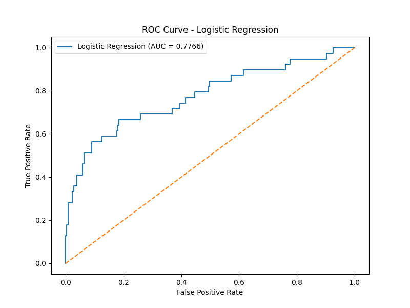
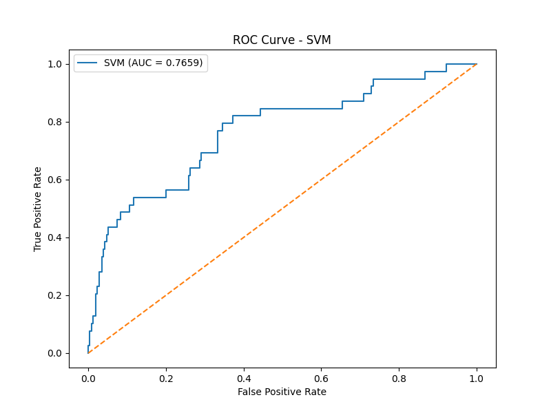
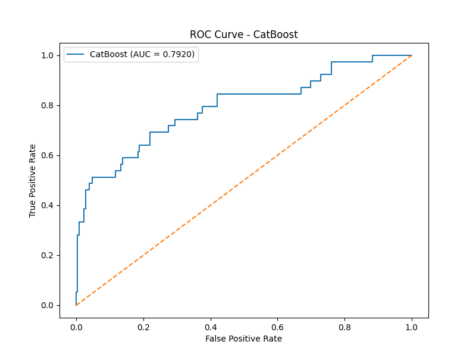
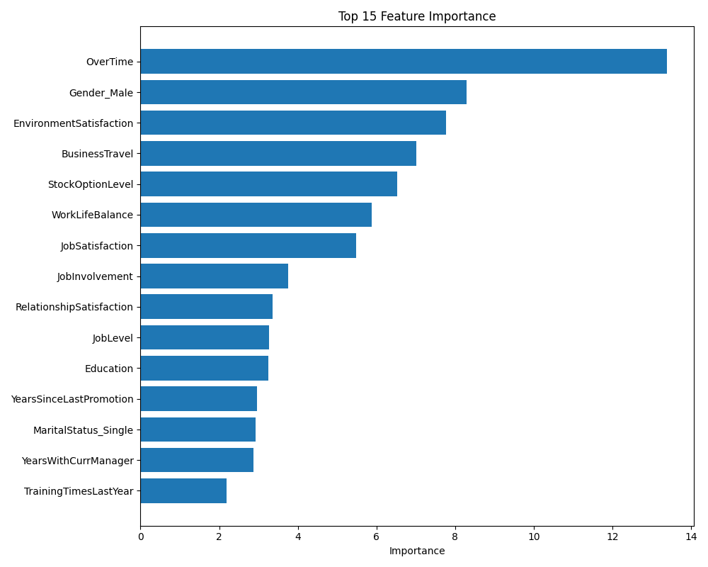

# HR Attrition Prediction

직원의 인사 데이터를 기반으로 이직 여부를 예측하는 머신러닝 프로젝트입니다.

---

## Project Goal
IBM HR Analytics 데이터셋을 활용하여 직원의 이직 가능성을 예측하는 분류 모델을 구현합니다.  
단순 모델 학습에 그치지 않고, PostgreSQL DB 연동 및 데이터 파이프라인 구성까지 포함합니다.

---

## Tech Stack
- **Language**: Python
- **Data**: Pandas, NumPy
- **ML**: scikit-learn
- **Database**: PostgreSQL, SQLAlchemy, Supabase
- **Environment**: dotenv, venv
- **API**: FastAPI, Uvicorn
- **Deployment**: Docker

---

## Project Structure

```
hr-attrition-prediction/
├── app/
│   ├── base.py
│   ├── database.py
│   ├── eda.py
│   ├── insert_data.py
│   ├── main.py
│   ├── models.py
│   ├── preprocess.py
│   └── train.py
├── assets/
│   ├── roc_lr.png
│   ├── roc_svm.png
│   ├── roc_catboost.png
│   ├── roc_lr.png
├── data/
│   └── WA_Fn-UseC_-HR-Employee-Attrition.csv
├── models/
│   ├── catboost_best_model.pkl
│   └── scaler.pkl
├── notebooks/
│   └── eda.ipynb
│   └── test.ipynb
└── .dockerignore
└── Dockerfile
└── requirements.txt
```

---

## Progress
- [x] 데이터 수집 (IBM HR Analytics Dataset)
- [x] PostgreSQL DB 설계 및 SQLAlchemy 연결
- [x] CSV → DB 적재 파이프라인 구성
- [x] EDA
- [x] 데이터 전처리 (인코딩, 스케일링, train/test split)
- [X] 모델 학습 및 성능 비교 (Random Forest, XGBoost 등)
- [X] API 연동
- [X] Docker 배포

---

## Models
- Logistic Regression
- Decision Tree
- Random Forest
- AdaBoost
- XGBoost
- SVM
- KNN
- GBM
- LightGBM
- CatBoost

---

## Evaluate Metrics
- Accuracy
- Precision
- Recall
- F1-score
- Confusion Matrix
- AUC Score
- Roc Curve

---

## Future Work
- Streamlit 기반 웹 서비스화
- SHAP 기반 모델 해석

---

## Results
| model | AUC | Recall (True) | F1 (True) |
|-------|-----|---------------|-----------|
| Logistic Regression (tuned) | 0.7888 | 0.72 | 0.43 |
| SVM (tuned) | 0.7752 | 0.64 | 0.42 |
| CatBoost (tuned) | 0.7920 | 0.51 | 0.53 |

## ROC Curve





## Feature Importance (Top 5)
| Feature | Importance |
|---------|------------|
| OverTime | 13.39% |
| Gender_Male | 8.30% |
| EnvironmentSatisfaction | 7.77% |
| BusinessTravel | 7.02% |
| StockOptionLevel | 6.53% |